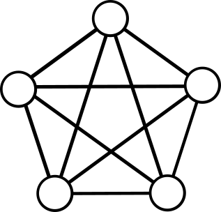
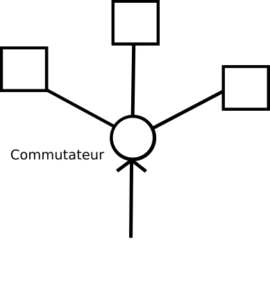
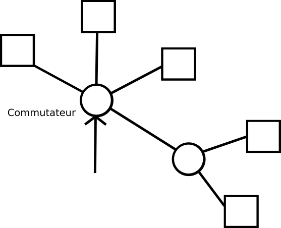
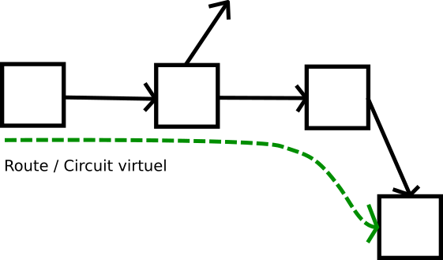
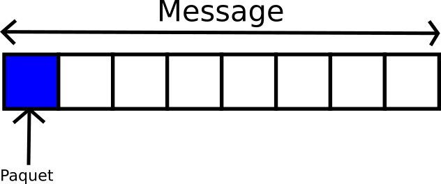

# Introduction

# Réseaux
## Téléphone
### Réseau téléphonique commuté
Selon le modèle de Jules Verne :

$\frac {n(n-1)} {2}$ liaisons.

Solution la centrale avec commutateur. Originellement des filles de communication s'occupaient des commutations. 

La commutation change la topologe du réseau, une connexion inexistante est créée.

L'adition de commutateur au réseau angmente la capacité de façon exponentielle.

### Deux défauts

- Doit être connecté de bout en bout.
- Pas de préemption.

## Télégraphe
### Commutation de messages
Grille de lettres et chiffres indique la destination, mais le chemin n'existe pas forcément.

On transfère le message de bureau en bureau, l'nformation suit une concatenation de circuits et forme une route.

Si le message est mal envoyé est renvoyé.
Si trop de charge, on peut rerouter.
Si on noeud est supprimé on peut rerouter.

### Deux défauts
La commutation de messages induit une taille limite, car si trop grand :
- Probabilité d'échec : Plus le message est long plus la probabilité de le restituer correctement est proche de 0.
- Temps d'accès au lien.

## Solution
### Commutation de paquet.

La decoupe en paquet limités.

Chaque paquet est noté independamment.

- Excellentte résilience aux pannes.
- Intelligence est aux bouts du réseau.

Le réseau à moins de chose à faire et le réseau ne peut pas savoir ce que l'on fait. Ainsi, le deploiement est facile.
Mais cela entraine des inefficacités.

L'intelligence à l'interieur du réseau provoque une *ossification* du réseau - elle en perd sa *flexibilité*.

# Structure par couche

Chaque nouvelle technologie implique une adaptation de celle-ci aux diverses applications qui vont l'utiliser.
Protocole de convergence : Protocole de commutation de paquets.

*schéma 6*

Il faut impérativement préserver les couches du réseau et donc ne pas violer celles-ci pour préserver son implémentation. *i.e* : La violation de la couche basse par Android ou iOS vie le control des MàJ vie réseau cellulaire ou Wi-Fi.

## Modèle OSI simplifié

5 couches numérotées de 1 à 7.

*schéma 7*

La couche 4 de transport s'occupe de la découpe des données en paquets.
Les couches 1 à 3 existent dans tout le réseau, mais les couches 4 à 7 n'existent qu'aux extremités.

Petite pensée envers les firewalls de Windows et les étuduants hackeurs russes.

## IPv4 Épuisement de l'espace d'addressage

Chaque paquet contient son émetteur et récepteur. 
Une addresse contient 32bit (4 octets) soit $4.10^6$ addresses possibles.
Or chaque humain a en moyenne 3 objet connecté donc l'espace d'addressage est épuisé.

### On est obligés de tricher

On utilise alors des réseaux privés (*proxy*) ou des NAT.

## IPv6 La même chose en un petit peu mieux.

Créé en 1993, on a alors 128 bits d'addresse.

### Conséquences

- À la couche de convergence, il y a 2 protocoles.
- La couche application doit gérer les 2.

# L'API socket

&rarr; Ne pas comprendre les détails : car écrit par des hippies.

Cette API est unverselle et fonctionne sur UNIX/Linux/MacOS/BSD  et *- Oh grande surprise ! -* Windows